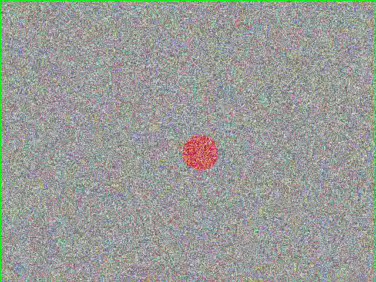

# Motion Tracking System
A motion tracking system in real-time that was constructed using classical computer vision as a course of CSE3010 Computer Vision. Video footage is processed by the system to dynamically model the background, identify moving distinct objects, visualize their bounding boxes, and specifically log the exact timestamps of motion events.

---

## Demo
 *(Replace with actual output image)*

---

## Features
- Identifies and tracks moving objects in video footage.
- Gaussian Mixture Model (GMM) to dynamically separate foreground from background.
- Morphological operations (Erosion & Dilation) to reduce noise and group fragmented parts.
- Visualization of moving objects with green bounding boxes.
- Precise motion logging (down to the second) without duplicating entries.
- FPS independent timestamp extraction.
- Completely headless execution - fully runnable at the command line with no interactive GUI needed.
- Built-in synthetic test video generator for immediate testing.

---

## Tech Stack
- Python 3.x
- OpenCV
- NumPy

---

## Project Structure
```
cv_project_motion-tracking/
├── generate_test_video.py
├── tracker.py
├── test_video.mp4           (Generated input)
├── processed_video.mp4      (Generated output)
└── motion_events.txt        (Generated log)
```

---

## Output Log
After every run, a `motion_events.txt` file is generated summarising the precise timestamps (in seconds) during which motion was detected in the video feed.

---

## Dataset
This project can process any standard video file (e.g., MP4, AVI). 
For demonstration, a `generate_test_video.py` script is included to automatically synthetically generate a `test_video.mp4` file containing a moving target.

---

## Installation
1. Clone the repository:
```bash
git clone https://github.com/yourusername/cv_project_motion-tracking.git
cd cv_project_motion-tracking
```

2. Install dependencies:
```bash
pip install opencv-python numpy
```

---

## Usage
1. (Optional) Generate a test video:
```bash
python generate_test_video.py
```

2. Execute the tracker script:
```bash
python tracker.py --input test_video.mp4 --output-vid processed_video.mp4 --log motion_events.txt --min-area 500
```

The script will automatically process the provided `--input` video and output the annotated footage to `--output-vid` while logging timestamps to `--log`. None of the GUI or manual input is needed.

---

## How It Works
The pipeline has the following stages:

1. **Gaussian Mixture Model (GMM) Background Subtraction** - Uses `cv2.createBackgroundSubtractorMOG2()` to dynamically model the background as a mixture of Gaussian distributions. It adapts to varying illumination and isolates the true moving foreground.

2. **Thresholding** - Filters the output mask to effectively remove gray shadow pixels, isolating only the pure white foreground objects.

3. **Erosion** - Strips away the outermost layers of the foreground regions using a 5x5 kernel. This minimizes isolated salt-and-pepper sensor noise and tiny background movements.

4. **Dilation** - Expands the boundaries of the remaining foreground regions over 2 iterations. This fills in small internal holes and reconnects parts of a single moving object that erosion might have fragmented.

5. **Contour Detection** - Identifies the continuous boundaries of the cleaned foreground objects using `cv2.findContours(..., cv2.RETR_EXTERNAL, ...)`.

6. **Target Filtering & HUD Overlay** - Filters out any contours smaller than the user-defined `--min-area` (default: 500). A clear green bounding box is drawn directly onto the original frame for objects passing the size threshold.

7. **Timestamp Parsing** - Calculates the active relative second using the frame count and FPS, logging the event uniquely if motion is captured in that integral second.

---

## Syllabus Coverage (CSE3010)
| Module | Topic | Implementation |
|--------|-------|----------------|
| Module 2 | Morphological Image Processing | `cv2.erode`, `cv2.dilate` |
| Module 3 | Image Segmentation | `cv2.threshold`, contour extraction |
| Module 4 | Motion Analysis & Background Subtraction | `cv2.createBackgroundSubtractorMOG2` |

---

## Limitations
- The camera must remain completely stationary. Heavy camera shake will cause the entire frame to register as foreground motion.
- Very slow-moving objects may eventually be absorbed into the background model by the GMM.
- Multiple moving objects overlapping each other will merge into a single large bounding box rather than remaining distinct tracking instances.
- Background adaptation takes a few frames to initialize properly (gradually capturing the static scene).

---

## Course
CSE3010 — Computer Vision  
VIT Bhopal University
